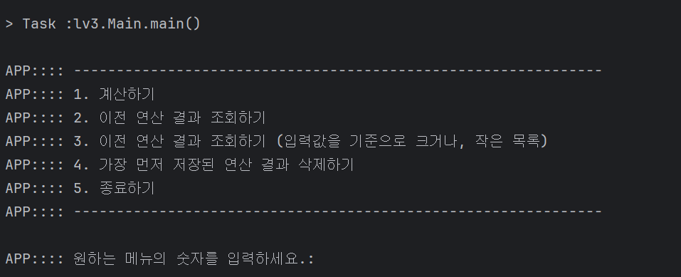

# nbcamp-ch2-calculator

Chapter2 계산기 과제에 대한 리포지토리입니다.



## 1. 프로젝트 개요

- **콘솔 기반 사칙연산 계산기 개발 프로젝트**
- 내일배움캠프 Chapter2-1 과제
- 1인 개발

## 2. 주요 기능

- **사칙연산 기능**
    - 2개의 숫자와 사칙연산 기호를 입력 받음
    - 정수수끼리, 실수끼리 그리고 정수와 실수 함께 연산 가능
- **연산 결과 저장 및 조회 기능**
    - 연산 결과를 자동 저장
    - 저장된 모든 연산 결과를 조회
    - 특정 값보다 크거나 작은 결과만 필터링하여 조회
- **연산 결과 삭제 기능**
    - 가장 먼저 저장된 연산 결과 삭제
- **콘솔을 이용한 사용자 입력 기반 동작**
    - 사용자 입력에 따라 작동
    - 반복 가능

## 3. 적용 기술

- **Java 및 객체지향 프로그래밍**
    - JDK 설치 및 프로젝트 생성
    - 변수 선언 및 primitive type과 refrence type
    - 조건문과 반복문을 이용한 흐름 제어
    - field 및 method를 이용한 class 정의 및 객체 생성
    - Interface
    - Enum
    - Collections
    - Generic
    - Lambda 및 Stream
    - Exception과 try-catch

## 4. 프로젝트 구조 및 실행 방법

```
📦 nbcamp-ch2-calculator
      └─ src/java
             ├─ lv1
             │  └─ Calculator.java // Calculator 구현 및 실행 클래스
             ├─ lv2
             │  ├─ App.java // 콘솔 App 구현 및 실행 클래스
    				 │	├─ Calculator.java // Calculator 로직 클래스
             │  └─ Menu.java // 사용자 콘솔 Menu 구현 클래스
             └─ lv3
                ├─ App.java // 콘솔 App 구현 클래스
                ├─ ArithmeticCalculator.java // 사칙연산 로직 클래스
                ├─ Calculator.java // Calculator 인터페이스
                ├─ Main.java // 실행 클래스
                ├─ Menu.java // 사용자 콘솔 Menu Enum 클래스
                └─ OperatorType.java // 연산자 Enum 클래스
```

- **Level 1: 클래스 없이 기본적인 연산을 수행할 수 있는 계산기 만들기**
    - lv1/Calculator.java의 main 메소드 실행
- **Level 2: 클래스를 적용해 기본적인 연산을 수행할 수 있는 계산기 만들기**
    - lv2/App.java의 main 메소드 실행
- **Level 3: Enum, 제네릭, 람다 & 스트림을 이해한 계산기 만들기**
    - lv3/Main.java의 main 메소드 실행

```bash
git clone https://github.com/seonrizee/nbcamp-ch2-calculator.git
cd nbcamp-ch2-calculator/src/java
javac -d . src/lv3/*.java # lv3 소스 코드 컴파일
java lv3.Main # Main 클래스 실행
```

- **Java 17** 사용 권장
- 의존성 없음

## 5. 주요 설계 및 트러블 슈팅

### [Level 1 회고](https://seonrizee.github.io/blog/2025-07-11-ch2-calculator-lev1/)

- next(), nextInt() 그리고 nextLine()

### [Level 2 회고](https://seonrizee.github.io/blog/2025-07-14-ch2-calculator-lev2/)

- 연산 결과를 저장할 Collections 타입
- private, final, getter, setter 그리고 Collections를 사용할 때의 캡슐화
- App Class와 Calculator 클래스의 역할 분리
- 사용자 콘솔 메뉴 관리를 위한 Enum 적용
- Queue의 Poll()과 remove()의 차이 그리고 Optional

### [Level 3 회고](https://seonrizee.github.io/blog/2025-07-15-ch2-calculator-lev3/)

- Enum에 비즈니스 로직을 포함해야 하는가?
- Generic의 필요성과 다양한 숫자 타입(정수, 실수) 처리 설계
- Enum 에서 제공하는 ordinal() 사용 여부
- App 클래스를 static 기반으로 만들지, 인스턴스화를 고민할지
- Calculator 인터페이스 분리의 필요성과 시점
- Enum 상수에 대한 접근 방법과 성능

## 6. 브랜치 전략 및 커밋 컨벤션

### 브랜치 전략

- Level 1: git flow 적용
- Level 2~3: develop 브랜치 개발 → main 브랜치 PR 적용

### 커밋 컨벤션

[**Conventional Commits 참고**](https://www.conventionalcommits.org/ko/v1.0.0/)

```
feat: 새로운 기능 추가
fix: 버그 수정
refactor: 코드 리펙토링
docs: 문서 추가 및 수정
```